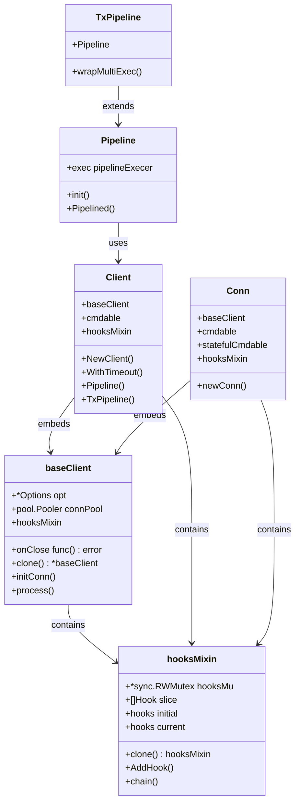
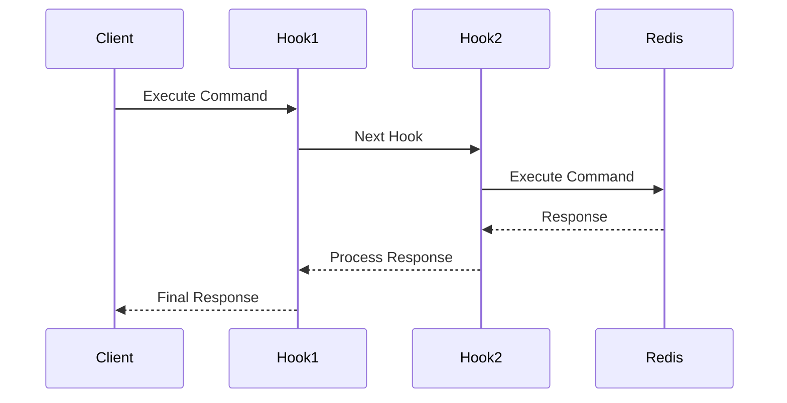
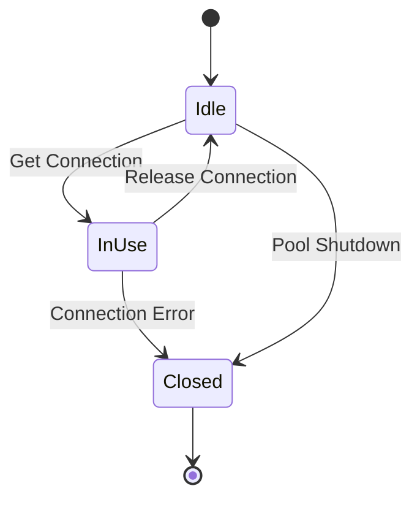
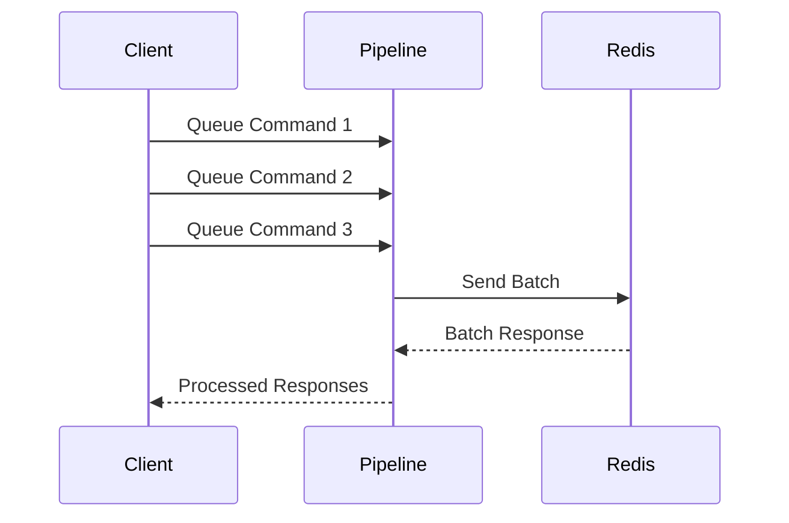
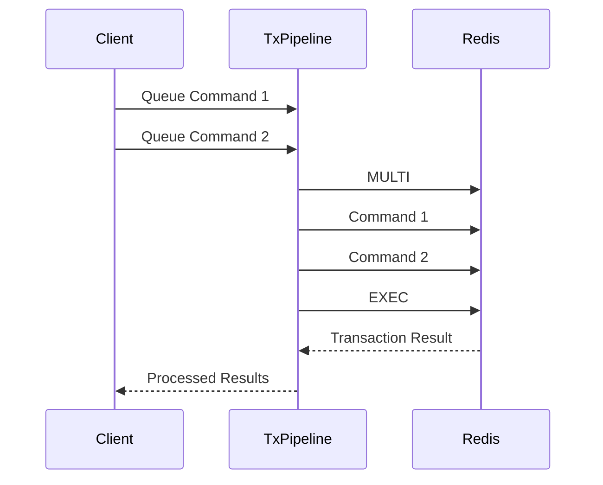
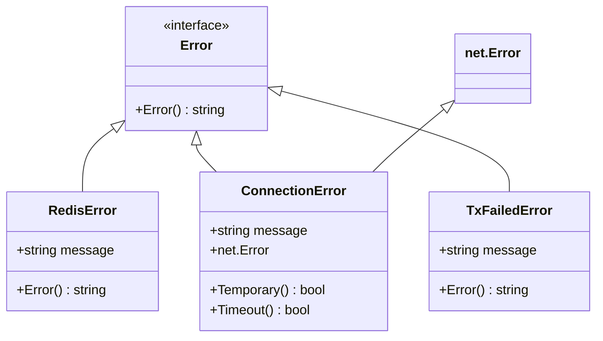
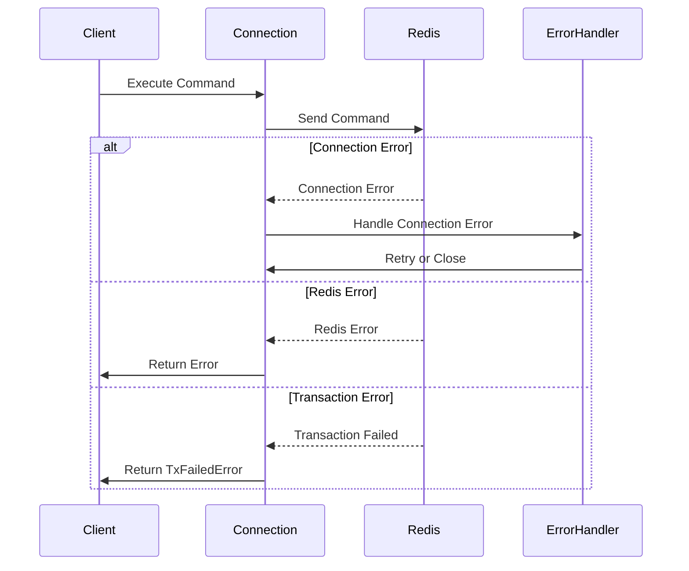
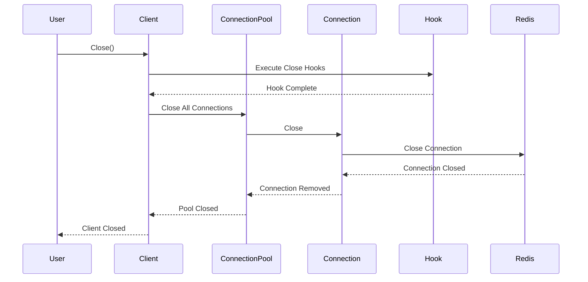
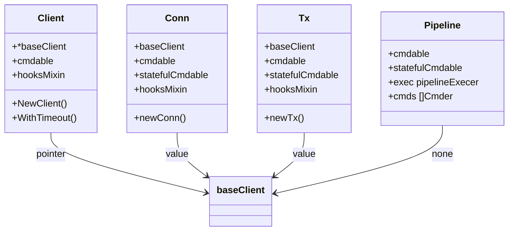

# Redis Client Architecture

This document explains the relationships between different components of the Redis client implementation, focusing on client types, connections, pools, and hooks.

## Client Hierarchy

### Component Relationships



### Hook Chain Flow



### Connection Pool Management



### Pipeline Execution Flow



### Transaction Pipeline Flow



### Base Client (`baseClient`)

The `baseClient` is the foundation of all Redis client implementations. It contains:
- Connection pool management
- Basic Redis command execution
- Hook management
- Connection lifecycle handling

```go
type baseClient struct {
    opt      *Options
    connPool pool.Pooler
    hooksMixin
    onClose func() error
}
```

### Client Types

1. **Client (`Client`)**
   - The main Redis client used by applications
   - Represents a pool of connections
   - Safe for concurrent use
   - Embeds `baseClient` and adds command execution capabilities
   - Primary entry point for most Redis operations
   - Handles connection pooling and retries automatically

2. **Conn (`Conn`)**
   - Represents a single Redis connection
   - Used for stateful operations like pub/sub
   - Required for blocking operations (BLPOP, BRPOP)
   - Also embeds `baseClient`
   - Has additional stateful command capabilities
   - Not safe for concurrent use

3. **Pipeline (`Pipeline`)**
   - Used for pipelining multiple commands
   - Not a standalone client, but a wrapper around existing clients
   - Batches commands and sends them in a single network roundtrip

4. **Transaction Pipeline (`TxPipeline`)**
   - Similar to Pipeline but wraps commands in MULTI/EXEC
   - Ensures atomic execution of commands
   - Also a wrapper around existing clients

## Pointer vs Value Semantics

### When `baseClient` is a Pointer

The `baseClient` is used as a pointer in these scenarios:

1. **Client Creation**
   ```go
   func NewClient(opt *Options) *Client {
       c := Client{
           baseClient: &baseClient{
               opt: opt,
           },
       }
   }
   ```
   - Used as pointer to share the same base client instance
   - Allows modifications to propagate to all references
   - More efficient for large structs

2. **Connection Pooling**
   - Pooled connections need to share the same base client configuration
   - Pointer semantics ensure consistent behavior across pooled connections

### When `baseClient` is a Value

The `baseClient` is used as a value in these scenarios:

1. **Cloning**
   ```go
   func (c *baseClient) clone() *baseClient {
       clone := *c
       clone.hooksMixin = c.hooksMixin.clone()
       return &clone
   }
   ```
   - Creates independent copies for isolation
   - Prevents unintended sharing of state
   - Used when creating new connections or client instances

2. **Temporary Operations**
   - When creating short-lived client instances
   - When isolation is required for specific operations

## Hooks Management

### HooksMixin

The `hooksMixin` is a struct that manages hook chains for different operations:

```go
type hooksMixin struct {
    hooksMu *sync.RWMutex
    slice   []Hook
    initial hooks
    current hooks
}
```

### Hook Types

1. **Dial Hook**
   - Called during connection establishment
   - Can modify connection parameters
   - Used for custom connection handling

2. **Process Hook**
   - Called before command execution
   - Can modify commands or add logging
   - Used for command monitoring

3. **Pipeline Hook**
   - Called during pipeline execution
   - Handles batch command processing
   - Used for pipeline monitoring

### Hook Lifecycle

1. **Initialization**
   - Hooks are initialized when creating a new client
   - Default hooks are set up for basic operations
   - Hooks can be added or removed at runtime

2. **Hook Chain**
   - Hooks are chained in LIFO (Last In, First Out) order
   - Each hook can modify the command or response
   - Chain can be modified at runtime
   - Hooks can prevent command execution by not calling next

3. **Hook Inheritance**
   - New connections inherit hooks from their parent client
   - Hooks are cloned to prevent shared state
   - Each connection maintains its own hook chain
   - Hook modifications in child don't affect parent

## Connection Pooling

### Pool Types

1. **Single Connection Pool**
   - Used for dedicated connections
   - No connection sharing
   - Used in `Conn` type

2. **Multi Connection Pool**
   - Used for client pools
   - Manages multiple connections
   - Handles connection reuse

### Pool Management

1. **Connection Acquisition**
   - Connections are acquired from the pool
   - Pool maintains minimum and maximum connections
   - Handles connection timeouts

2. **Connection Release**
   - Connections are returned to the pool
   - Pool handles connection cleanup
   - Manages connection lifecycle

### Pool Configuration

1. **Pool Options**
   - Minimum idle connections
   - Maximum active connections
   - Connection idle timeout
   - Connection lifetime
   - Pool health check interval

2. **Health Checks**
   - Periodic connection validation
   - Automatic reconnection on failure
   - Connection cleanup on errors
   - Pool size maintenance

## Transaction and Pipeline Handling

### Pipeline

1. **Command Batching**
   - Commands are queued in memory
   - Sent in a single network roundtrip
   - Responses are collected in order

2. **Error Handling**
   - Pipeline execution is atomic
   - Errors are propagated to all commands
   - Connection errors trigger retries

### Transaction Pipeline

1. **MULTI/EXEC Wrapping**
   - Commands are wrapped in MULTI/EXEC
   - Ensures atomic execution
   - Handles transaction errors

2. **State Management**
   - Maintains transaction state
   - Handles rollback scenarios
   - Manages connection state

### Pipeline Limitations

1. **Size Limits**
   - Maximum commands per pipeline
   - Memory usage considerations
   - Network buffer size limits
   - Response size handling

2. **Transaction Behavior**
   - WATCH/UNWATCH key monitoring
   - Transaction isolation
   - Rollback on failure
   - Atomic execution guarantees

## Error Handling and Cleanup

### Error Types and Handling



### Error Handling Flow



### Connection and Client Cleanup



### Error Handling Strategies

1. **Connection Errors**
   - Temporary errors (network issues) trigger retries
   - Permanent errors (invalid credentials) close the connection
   - Connection pool handles reconnection attempts
   - Maximum retry attempts configurable via options

2. **Redis Errors**
   - Command-specific errors returned to caller
   - No automatic retries for Redis errors
   - Error types include:
     - Command syntax errors
     - Type errors
     - Permission errors
     - Resource limit errors

3. **Transaction Errors**
   - MULTI/EXEC failures return `TxFailedError`
   - Individual command errors within transaction
   - Watch/Unwatch failures
   - Connection errors during transaction

### Cleanup Process

1. **Client Cleanup**
   ```go
   func (c *Client) Close() error {
       // Execute close hooks
       if c.onClose != nil {
           c.onClose()
       }
       // Close connection pool
       return c.connPool.Close()
   }
   ```
   - Executes registered close hooks
   - Closes all connections in pool
   - Releases all resources
   - Thread-safe operation

2. **Connection Cleanup**
   ```go
   func (c *Conn) Close() error {
       // Cleanup connection state
       c.state = closed
       // Close underlying connection
       return c.conn.Close()
   }
   ```
   - Closes underlying network connection
   - Cleans up connection state
   - Removes from connection pool
   - Handles pending operations

3. **Pool Cleanup**
   - Closes all idle connections
   - Waits for in-use connections
   - Handles connection timeouts
   - Releases pool resources

### Best Practices for Error Handling

1. **Connection Management**
   - Always check for connection errors
   - Implement proper retry logic
   - Handle connection timeouts
   - Monitor connection pool health

2. **Resource Cleanup**
   - Always call Close() when done
   - Use defer for cleanup in critical sections
   - Handle cleanup errors
   - Monitor resource usage

3. **Error Recovery**
   - Implement circuit breakers
   - Use backoff strategies
   - Monitor error patterns
   - Log error details

4. **Transaction Safety**
   - Check transaction results
   - Handle watch/unwatch failures
   - Implement rollback strategies
   - Monitor transaction timeouts

### Context and Cancellation

1. **Context Usage**
   - Command execution timeout
   - Connection establishment timeout
   - Operation cancellation
   - Resource cleanup on cancellation

2. **Pool Error Handling**
   - Connection acquisition timeout
   - Pool exhaustion handling
   - Connection validation errors
   - Resource cleanup on errors

## Best Practices

1. **Client Usage**
   - Use `Client` for most operations
   - Use `Conn` for stateful operations
   - Use pipelines for batch operations

2. **Hook Implementation**
   - Keep hooks lightweight
   - Handle errors properly
   - Call next hook in chain

3. **Connection Management**
   - Let the pool handle connections
   - Don't manually manage connections
   - Use appropriate timeouts

4. **Error Handling**
   - Check command errors
   - Handle connection errors
   - Implement retry logic when needed

## Deep Dive: baseClient Embedding Strategies

### Implementation Examples

1. **Client Implementation (Pointer Embedding)**
   ```go
   type Client struct {
       *baseClient  // Pointer embedding
       cmdable
       hooksMixin
   }

   func NewClient(opt *Options) *Client {
       c := Client{
           baseClient: &baseClient{  // Created as pointer
               opt: opt,
           },
       }
       c.init()
       c.connPool = newConnPool(opt, c.dialHook)
       return &c
   }
   ```
   The `Client` uses pointer embedding because:
   - It needs to share the same `baseClient` instance across all operations
   - The `baseClient` contains connection pool and options that should be shared
   - Modifications to the base client (like timeouts) should affect all operations
   - More efficient for large structs since it avoids copying

2. **Conn Implementation (Value Embedding)**
   ```go
   type Conn struct {
       baseClient  // Value embedding
       cmdable
       statefulCmdable
       hooksMixin
   }

   func newConn(opt *Options, connPool pool.Pooler, parentHooks hooksMixin) *Conn {
       c := Conn{
           baseClient: baseClient{  // Created as value
               opt:      opt,
               connPool: connPool,
           },
       }
       c.cmdable = c.Process
       c.statefulCmdable = c.Process
       c.hooksMixin = parentHooks.clone()
       return &c
   }
   ```
   The `Conn` uses value embedding because:
   - Each connection needs its own independent state
   - Connections are short-lived and don't need to share state
   - Prevents unintended sharing of connection state
   - More memory efficient for single connections

3. **Tx (Transaction) Implementation (Value Embedding)**
   ```go
   type Tx struct {
       baseClient  // Value embedding
       cmdable
       statefulCmdable
       hooksMixin
   }

   func (c *Client) newTx() *Tx {
       tx := Tx{
           baseClient: baseClient{  // Created as value
               opt:      c.opt,
               connPool: pool.NewStickyConnPool(c.connPool),
           },
           hooksMixin: c.hooksMixin.clone(),
       }
       tx.init()
       return &tx
   }
   ```
   The `Tx` uses value embedding because:
   - Transactions need isolated state
   - Each transaction has its own connection pool
   - Prevents transaction state from affecting other operations
   - Ensures atomic execution of commands

4. **Pipeline Implementation (No baseClient)**
   ```go
   type Pipeline struct {
       cmdable
       statefulCmdable
       exec pipelineExecer
       cmds []Cmder
   }
   ```
   The `Pipeline` doesn't embed `baseClient` because:
   - It's a temporary command buffer
   - Doesn't need its own connection management
   - Uses the parent client's connection pool
   - More lightweight without base client overhead

### Embedding Strategy Comparison



### Key Differences in Embedding Strategy

1. **Pointer Embedding (Client)**
   - Used when state needs to be shared
   - More efficient for large structs
   - Allows modifications to propagate
   - Better for long-lived instances
   - Memory Layout:
     ```
     +-------------------+
     | Client           |
     | +-------------+  |
     | | *baseClient |  |
     | +-------------+  |
     | | cmdable    |  |
     | +-------------+  |
     | | hooksMixin |  |
     | +-------------+  |
     +-------------------+
     ```

2. **Value Embedding (Conn, Tx)**
   - Used when isolation is needed
   - Prevents unintended state sharing
   - Better for short-lived instances
   - More memory efficient for small instances
   - Memory Layout:
     ```
     +-------------------+
     | Conn/Tx          |
     | +-------------+  |
     | | baseClient  |  |
     | | +---------+ |  |
     | | | Options | |  |
     | | +---------+ |  |
     | | | Pooler  | |  |
     | | +---------+ |  |
     | +-------------+  |
     | | cmdable    |  |
     | +-------------+  |
     | | hooksMixin |  |
     | +-------------+  |
     +-------------------+
     ```

3. **No Embedding (Pipeline)**
   - Used for temporary operations
   - Minimizes memory overhead
   - Relies on parent client
   - Better for command batching
   - Memory Layout:
     ```
     +-------------------+
     | Pipeline         |
     | +-------------+  |
     | | cmdable    |  |
     | +-------------+  |
     | | exec       |  |
     | +-------------+  |
     | | cmds       |  |
     | +-------------+  |
     +-------------------+
     ```

### Design Implications

1. **Resource Management**
   - Pointer embedding enables shared resource management
   - Value embedding ensures resource isolation
   - No embedding minimizes resource overhead

2. **State Management**
   - Pointer embedding allows state propagation
   - Value embedding prevents state leakage
   - No embedding avoids state management

3. **Performance Considerations**
   - Pointer embedding reduces memory usage for large structs
   - Value embedding improves locality for small structs
   - No embedding minimizes memory footprint

4. **Error Handling**
   - Pointer embedding centralizes error handling
   - Value embedding isolates error effects
   - No embedding delegates error handling

5. **Cleanup Process**
   - Pointer embedding requires coordinated cleanup
   - Value embedding enables independent cleanup
   - No embedding avoids cleanup complexity

### Best Practices

1. **When to Use Pointer Embedding**
   - Long-lived instances
   - Shared state requirements
   - Large structs
   - Centralized management

2. **When to Use Value Embedding**
   - Short-lived instances
   - State isolation needs
   - Small structs
   - Independent management

3. **When to Avoid Embedding**
   - Temporary operations
   - Minimal state needs
   - Command batching
   - Performance critical paths

### Authentication System

#### Streaming Credentials Provider
The Redis client supports a streaming credentials provider system that allows for dynamic credential updates:

```go
type StreamingCredentialsProvider interface {
    Subscribe(listener CredentialsListener) (Credentials, UnsubscribeFunc, error)
}

type CredentialsListener interface {
    OnNext(credentials Credentials)
    OnError(err error)
}

type Credentials interface {
    BasicAuth() (username string, password string)
    RawCredentials() string
}
```

Key Features:
- Dynamic credential updates
- Error handling and propagation
- Basic authentication support
- Raw credential access
- Subscription management

#### Re-Authentication Listener
The client includes a re-authentication listener for handling credential updates:

```go
type ReAuthCredentialsListener struct {
    reAuth func(credentials Credentials) error
    onErr  func(err error)
}
```

Features:
- Automatic re-authentication on credential updates
- Error handling and propagation
- Customizable re-authentication logic
- Thread-safe operation

#### Basic Authentication
The client provides a basic authentication implementation:

```go
type basicAuth struct {
    username string
    password string
}

func NewBasicCredentials(username, password string) Credentials {
    return &basicAuth{
        username: username,
        password: password,
    }
}
```

Usage:
- Simple username/password authentication
- Raw credential string generation
- Basic authentication support
- Thread-safe operation

// ... rest of existing content ... 