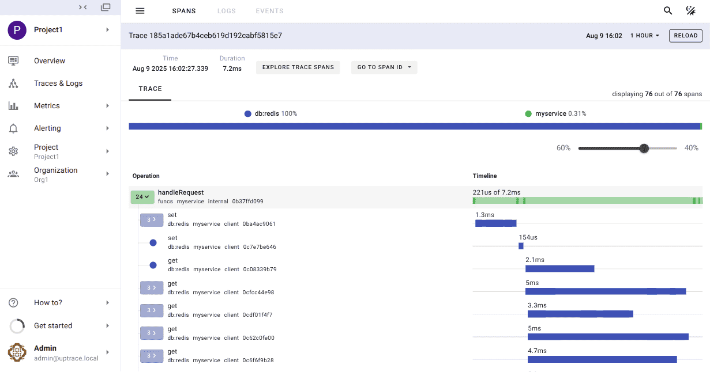
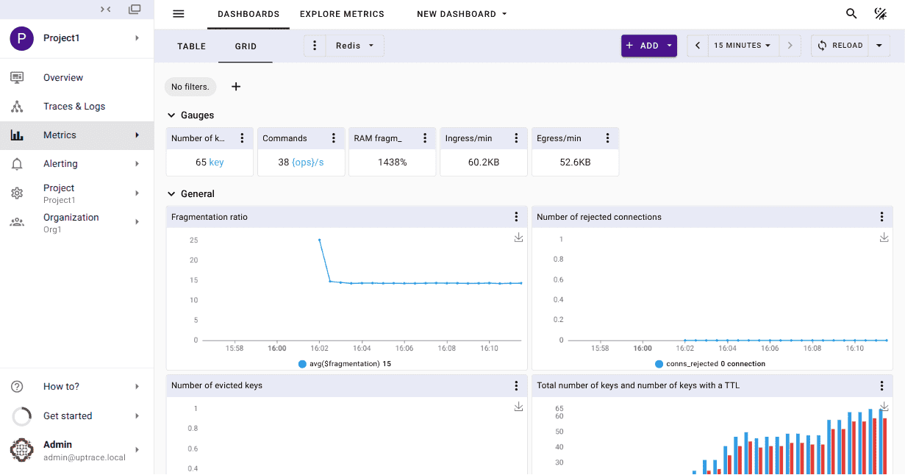

# Example for go-redis OpenTelemetry instrumentation

This example demonstrates how to monitor Redis using OpenTelemetry and
[Uptrace](https://github.com/uptrace/uptrace). It requires Docker to start Redis Server and Uptrace.

See
[Monitoring Go Redis Performance and Errors](https://redis.uptrace.dev/guide/go-redis-monitoring.html)
for details.

**Step 1**. Download the example using Git:

```shell
git clone https://github.com/go-redis/redis.git
cd example/otel
```

**Step 2**. Start the services using Docker:

```shell
docker-compose up -d
```

**Step 3**. Make sure Uptrace is running:

```shell
docker-compose logs uptrace
```

**Step 4**. Run the Redis client example and Follow the link to view the trace:

```shell
go run client.go
trace: http://localhost:14318/traces/ee029d8782242c8ed38b16d961093b35
```



You can also open Uptrace UI at [http://localhost:14318](http://localhost:14318) to view available
spans, logs, and metrics.

## Redis monitoring

You can also [monitor Redis performance](https://uptrace.dev/opentelemetry/redis-monitoring.html)
metrics By installing OpenTelemetry Collector.

[OpenTelemetry Collector](https://uptrace.dev/opentelemetry/collector.html) is an agent that pulls
telemetry data from systems you want to monitor and sends it to APM tools using the OpenTelemetry
protocol (OTLP).

When telemetry data reaches Uptrace, it automatically generates a Redis dashboard from a pre-defined
template.



## Links

- [Uptrace open-source APM](https://uptrace.dev/get/open-source-apm.html)
- [OpenTelemetry Go instrumentations](https://uptrace.dev/opentelemetry/instrumentations/?lang=go)
- [OpenTelemetry Go Tracing API](https://uptrace.dev/opentelemetry/go-tracing.html)
